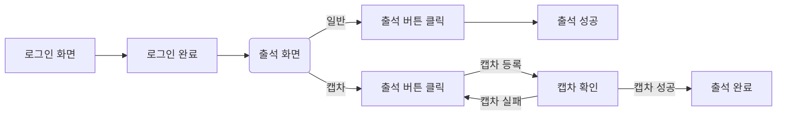
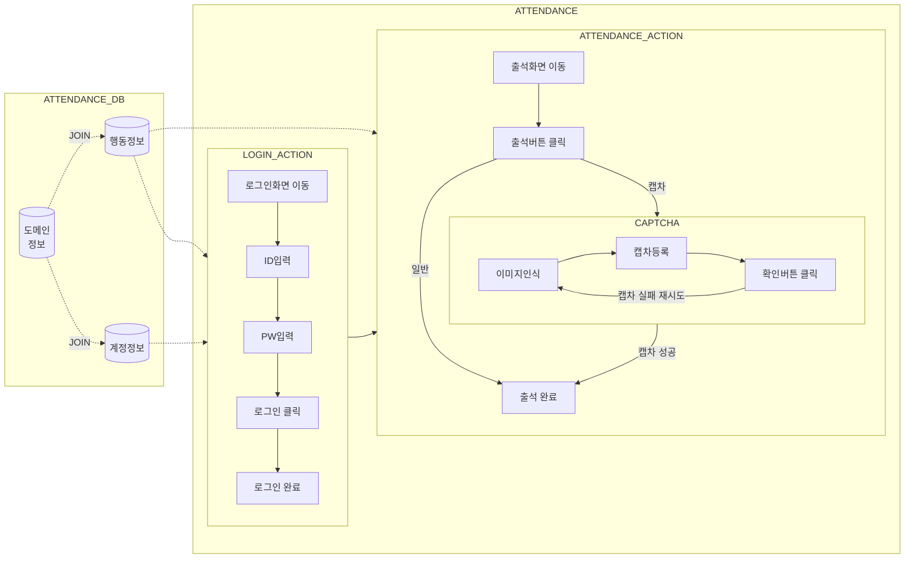

## 일반적인 출석체크 프로세스

- 일반적으로 로그인을 진행 후 출석 화면 이동 뒤 출석 버튼을 클릭하는 단순한 프로세스를 가진다.
- 출석체크 해야할 도메인이 많다면 각 도멘인별로 접속해서 각 아이디별로 로그인 한 뒤 출석체크를 진행해야 한다.
- 캡차가 있다면 캡차인증도 해주어야 하며, 캡차가 없다면 출석 버튼만 누르면 된다.

## 자동화 출석체크 프로세스

정의된 업무 프로세스는 다음과 같다.
1.  도메인 테이블과 계정 테이블을 JOIN하여, 출석체크를 수행할 도메인-계정 리스트를 가져온다.
2.  행동정보에 정의된 내용대로 로그인을 하고 출석체크를 수행한다.

## 행동의 정의
위 출석체크 프로세스의 흐름을 유저가 브라우저를 통해 화면을 컨트롤 하는 방식으로 구현하는 것이 중요하다.
때문에 브라우저에서 출석체크를 하기 위한 브라우저에서 행해지는 행위의 정의는 다음과 같다.

| 브라우저에서의 행위 설명                      | 해석된 행동구분 |
| ---------------------------------- | -------- |
| 정해진 url로 이동                        | move     |
| input 태그에 정해진 값 입력                 | input    |
| 클릭                                 | click    |
| alert, confirm 확인                  | confirm  |
| 캡차처리 (이미지인식 > 문자 input > 확인 click) | captcha  |
## 개발 방향
- 데이터베이스에 각 도메인 별 행동을 정의 한 뒤, 정의된 행동의 순서대로 브라우저가 움직일 수 있도록 구현.
- 도메인 별 행동은 같지만 다중 계정을 사용 할 수 있으므로 도메인정보, 계정정보, 행동정보는 따로 저장한다.

## 부가기능
1. 데이터베이스에 접근하기 위한 커넥션 풀 관리 기능
	- 저장된 계정, 행동정보, 로그를 조회/수정/입력을 하기 위한 용도
2. 로그 기능
	- 프로그램 실행 내역 저장
3. 비밀번호 관리를 위한 암/복호화 기능
	- 저장된 계정의 암호를 관리하기 위한 용도

