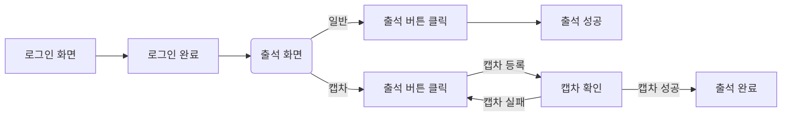
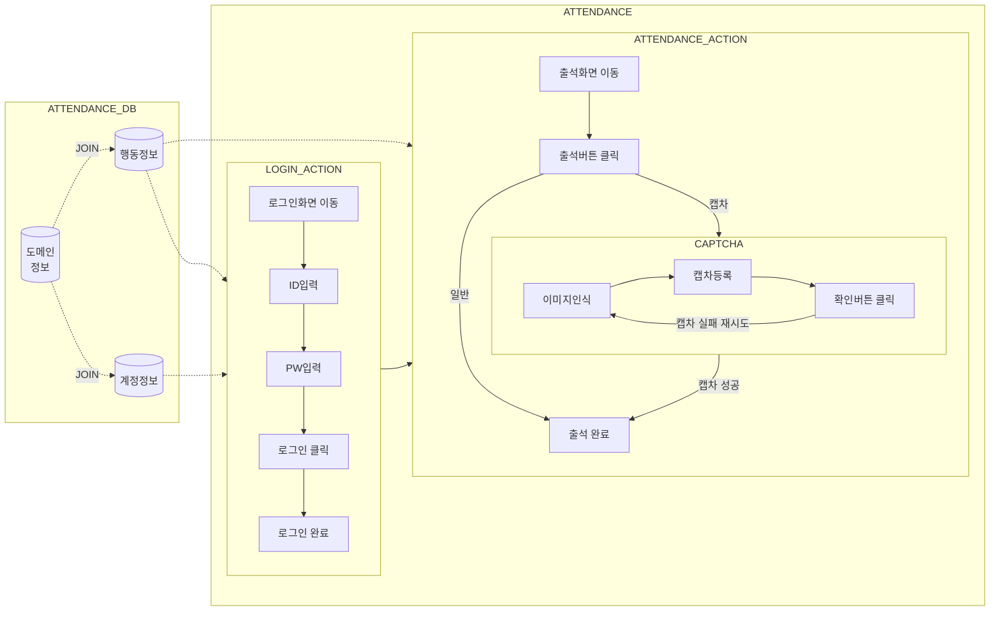

## 자동 출석체크를 어따써먹게?
도메인별로 정책은 다르지만 하루에 한번 출석하면 100원을 적립해주는 도메인가 많음
티끌을 모아서 재정에 보탬이 되기 위함

## 기존 출석체크 프로세스

- 일반적으로 로그인을 진행 후 출석 화면 이동 뒤 출석 버튼을 클릭하는 단순한 프로세스를 가진다.
- 출석체크 해야할 도메인이 많다면 각 도멘인별로 접속해서 각 아이디별로 로그인 한 뒤 출석체크를 진행해야 한다.
- 캡차가 있다면 캡차인증도 해주어야 하며, 캡차가 없다면 출석 버튼만 누르면 된다.

## 어떻게 구현할까?
### 업무 프로세스 정의

업무에 필요한 테이블은 다음과 같다.
- 도메인정보 : 출석체크를 수행 할 도메인의 정보를 가진다.
- 계정정보 : 출석체크를 수행 할 도메인의 계정정보를 가진다.
- 행동정보 : 로그인 및 출석체크를 할 때 필요한 행동을 가진다.

정의된 업무 프로세스는 다음과 같다.
1.  도메인 테이블과 계정 테이블을 JOIN하여, 출석체크를 수행할 도메인-계정 리스트를 가져온다.
2.  행동정보에 정의된 내용대로 로그인을 하고 출석체크를 수행한다.

### 행동의 정의
- 출석체크를 하기 위해 브라우저에서 행하는 모든 행위

| 행동구분    | 상세                                 |
| ------- | ---------------------------------- |
| move    | 정해진 url로 이동                        |
| input   | input 태그에 정해진 값 입력                 |
| click   | 엘리먼트 클릭                            |
| confirm | alert, confirm 확인                  |
| captcha | 캡차처리 (이미지인식 > 문자 input > 확인 click) |

## 부가기능
1. 데이터베이스에 접근하기 위한 커넥션 풀 관리 기능
	- 저장된 계정, 행동정보, 로그를 조회/수정/입력을 하기 위한 용도
2. 로그 기능
	- 프로그램 실행 내역 저장
3. 비밀번호 관리를 위한 암/복호화 기능
	- 저장된 계정의 암호를 관리하기 위한 용도

