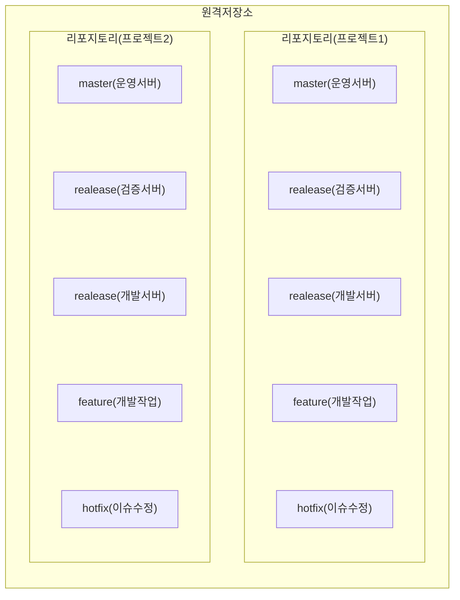
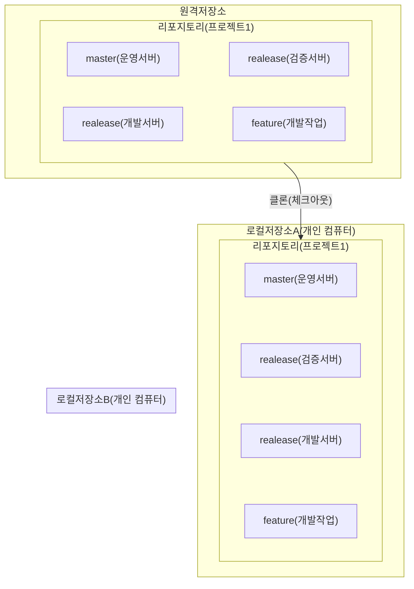
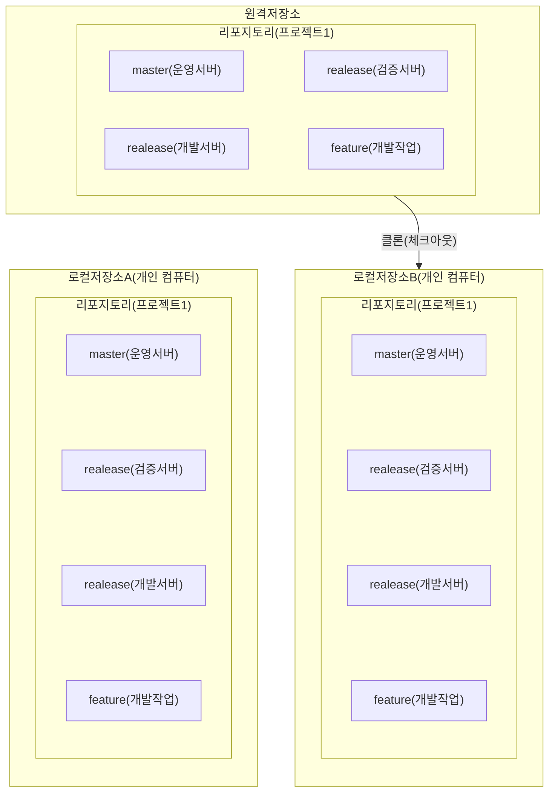
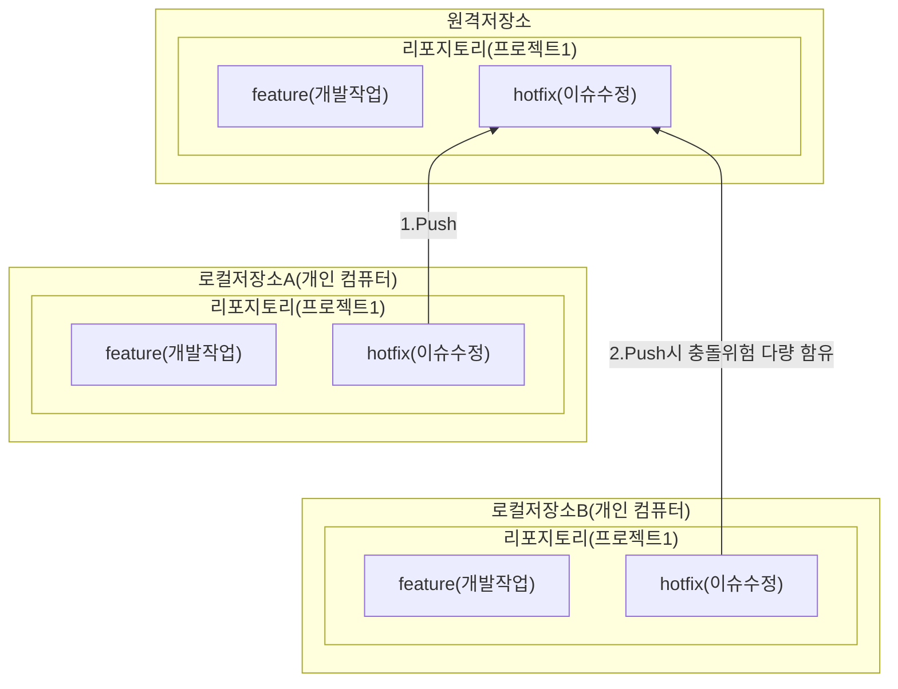
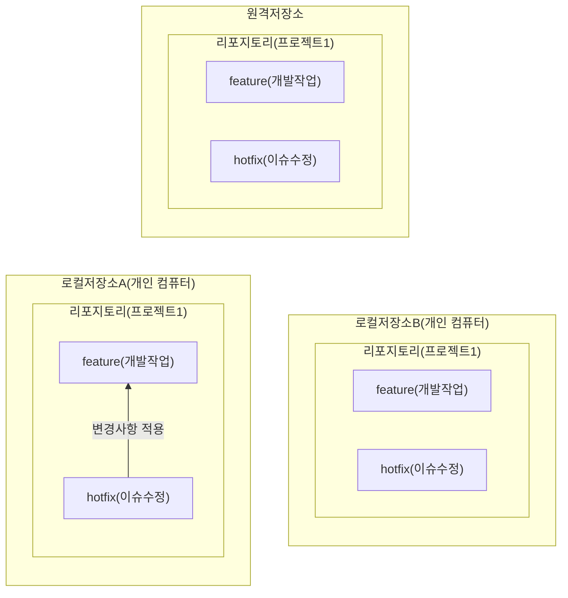

## 구조

- master : 제품으로 출시될 수 있는 브랜치
- release : 이번 출시 버전을 준비하는 브랜치
- develop : 다음 출시 버전을 개발하는 브랜치
- feature : 기능을 개발하는 브랜치
- hotfix : 출시 버전에서 발생한 버그를 수정 하는 브랜치

---
## clone :  리포지토리를 새 디렉터리에 복제하기

그림1

그림2

## add : 기록할 변경사항 추가하기

## commit : 로컬저장소에 변경사항 기록하기

## fetch : 변경사항 확인하기

## pull : 변경사항 땡겨오기
## push : 변경사항 원격 저장소에 밀어넣기

그림1

## merge : 브랜치간 변경사항 병합하기

