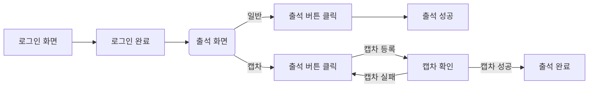
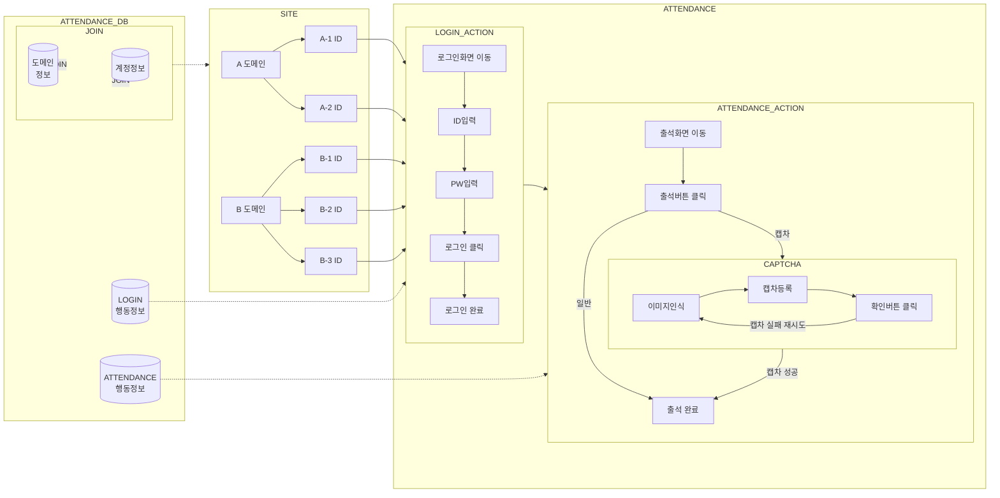

## 자동 출석체크를 어따써먹게?
도메인별로 정책은 다르지만 하루에 한번 출석하면 100원을 적립해주는 도메인가 많음
티끌을 모아서 재정에 보탬이 되기 위함

## 기존 출석체크 프로세스

- 일반적으로 로그인을 진행 후 출석 화면 이동 뒤 출석 버튼을 클릭하는 단순한 프로세스를 가진다.
- 출석체크 해야할 도메인이 많다면 각 도멘인별로 접속해서 각 아이디별로 로그인 한 뒤 출석체크를 진행해야 한다.
- 캡차가 있다면 캡차인증도 해주어야 하며, 캡차가 없다면 출석 버튼만 누르면 된다.

## 어떻게 구현할까?
### 업무 프로세스 정의

업무에 필요한 테이블은 다음과 같다.
- 도메인정보 : 출석체크를 수행 할 도메인의 정보를 가진다.
- 계정정보 : 출석체크를 수행 할 도메인의 계정정보를 가진다.
- 로그인 행동정보 : 로그인을 할 때 필요한 행동을 가진다.
- 출석체크 행동정보 : 출석체크를 할 때 필요한 행동을 가진다.

정의된 업무 프로세스는 다음과 같다.
1.  도메인 테이블과 계정 테이블을 JOIN하여, 출석체크를 수행할 도메인-계정 리스트를 가져온다.
2.  로그인 행동정보에 정의된 내용대로 가져온 계정을 사용하여 로그인 한다.
3.  출석체크 행동정보에 정의된 내용대로 출석체크를 실행한다.
### 개발환경
- OS : Windows
- IDE : Intellij Ultimate
- language : Python 3.10
- DB : Postgresql

언어는 파이썬을 선택하였다.
물론 파이썬을 모르는 자바 개발자이지만 패키지를 관리하고 코드를 작성하고 컴파일하고 실행하기 위한 절차가 너무 까다로운 나머지
간단하게 작성하고 바로 실행 할 수 있는 파이썬을 선택하였다. IDE는 인텔리J 얼티밋이 있어서 파이썬 플러그인을 설치하여 사용하였다.
### 필요기능
1. 데이터베이스에 접근하기 위한 커넥션 풀 관리 기능
	- 저장된 계정, 행동정보, 로그를 조회/수정/입력을 하기 위한 용도
2. 로그 관리 기능
	- 비정상 수행 시 분석을 하기 위한 용도
1. 비밀번호 관리를 위한 암/복호화 기능
	- 저장된 계정의 암호를 관리하기 위한 용도
2. 로그인과 출석체크를 위한 정의된 ACTION을 수행하는 기능
	- 본격적인 출석체크를 하기 위한 용도
## 어떻게 실행할까?
### 배포/실행환경

마침 github의 Action 이라는 기능을 사용하면 cron을 이용한 스케줄링 및 파이썬의 실행을 할 수 있다고 한다.
때문에 형상관리와 프로그램 실행을 github에서 하기로 하였다.

