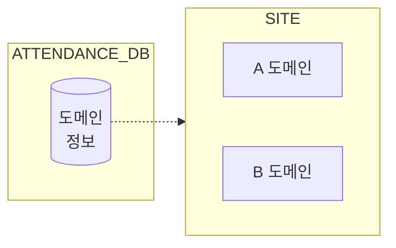
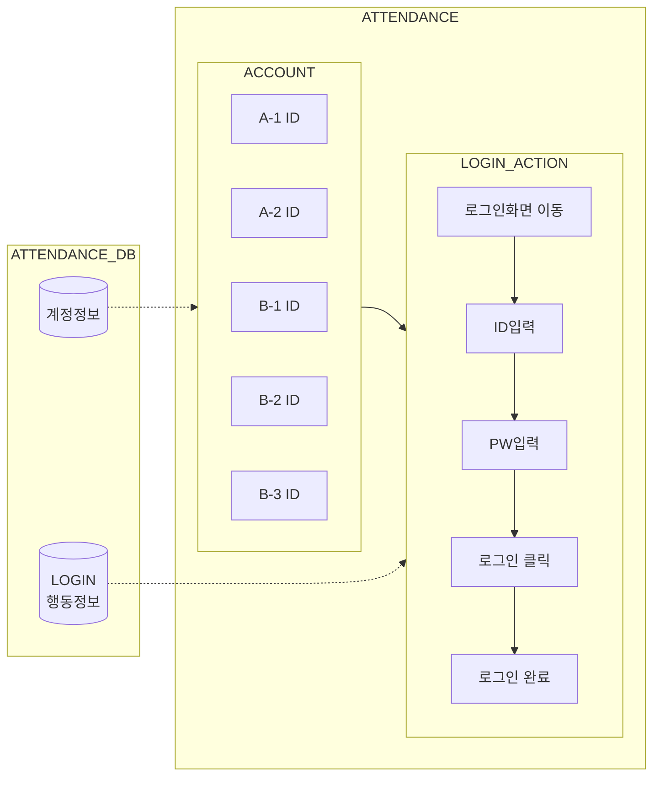
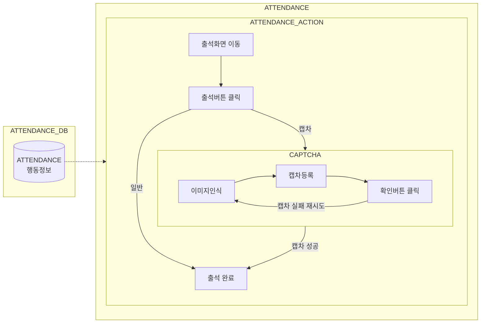
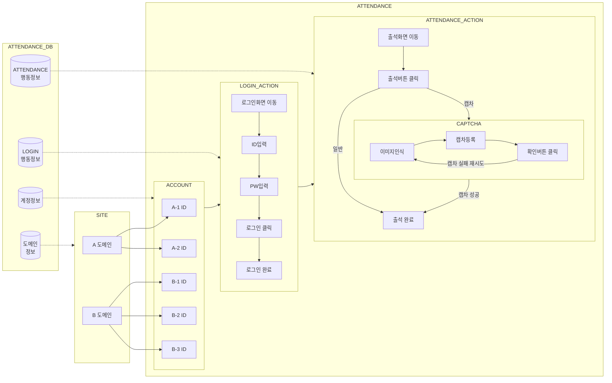

## 기능
### 출석체크
출석체크는 페이지 이동 > 로그인 > 출석체크라는 큰 범위 내에서 수행된다.
1. 페이지 이동

```mermaid
flowchart LR
	subgraph ATTENDANCE_DB
		direction LR
		
		DB1[(도메인
		정보)]
	end
	
	subgraph SITE
		direction LR
		A_SITE[A 도메인]
		B_SITE[B 도메인]
	end
	
	DB1 -.-> SITE
```

2. 로그인

```mermaid
flowchart LR
	subgraph ATTENDANCE_DB
		direction LR
		DB2[(계정정보)]
		DB3[(LOGIN
		행동정보)]
	end
	
	subgraph ATTENDANCE
		direction LR
	
		subgraph ACCOUNT
			direction LR
			A_SITE-1[A-1 ID]
			A_SITE-2[A-2 ID]
			B_SITE-1[B-1 ID]
			B_SITE-2[B-2 ID]
			B_SITE-3[B-3 ID]
		end
	
		subgraph LOGIN_ACTION
			direction TB
			LOGIN_ACTION_1[로그인화면 이동]
			LOGIN_ACTION_2[ID입력]
			LOGIN_ACTION_3[PW입력]
			LOGIN_ACTION_4[로그인 클릭]
			LOGIN_ACTION_5[로그인 완료]
			
			LOGIN_ACTION_1 --> LOGIN_ACTION_2 --> LOGIN_ACTION_3 --> LOGIN_ACTION_4 --> LOGIN_ACTION_5
		end
		
	    ACCOUNT --> LOGIN_ACTION
	end
	DB2 -.-> ACCOUNT
	DB3 -.-> LOGIN_ACTION
```

3. 출석체크

```mermaid
flowchart LR
	subgraph ATTENDANCE_DB
		direction LR
		DB4[(ATTENDANCE
		행동정보)]
	end
	
	subgraph ATTENDANCE
		direction LR
		subgraph ATTENDANCE_ACTION
			direction TB
			ATTENDANCE_ACTION_1[출석화면 이동]
			ATTENDANCE_ACTION_2[출석버튼 클릭]
			ATTENDANCE_ACTION_3[출석 완료]
			subgraph CAPTCHA
				direction LR
				CAPTCHA_1[이미지인식]
				CAPTCHA_2[캡차등록]
				CAPTCHA_3[확인버튼 클릭]
				
				CAPTCHA_1 --> CAPTCHA_2 --> CAPTCHA_3 --> |캡차 실패 재시도|CAPTCHA_1
			end
			
			ATTENDANCE_ACTION_1 --> ATTENDANCE_ACTION_2
			ATTENDANCE_ACTION_2 --> |일반|ATTENDANCE_ACTION_3
			ATTENDANCE_ACTION_2 --> |캡차|CAPTCHA --> |캡차 성공|ATTENDANCE_ACTION_3
				
		end
		
	end
	
	DB4 -.-> ATTENDANCE_ACTION
```

### 로깅
### 비밀번호 암/복호화
### 메일발송
### DB Connection

```mermaid
flowchart LR
	subgraph ATTENDANCE_DB
		direction LR
		
		DB1[(도메인
		정보)]
		DB2[(계정정보)]
		DB3[(LOGIN
		행동정보)]
		DB4[(ATTENDANCE
		행동정보)]
	end
	
	subgraph SITE
		direction LR
		A_SITE[A 도메인]
		B_SITE[B 도메인]
	end
	
	subgraph ATTENDANCE
		direction LR
	
		subgraph ACCOUNT
			direction LR
			A_SITE-1[A-1 ID]
			A_SITE-2[A-2 ID]
			B_SITE-1[B-1 ID]
			B_SITE-2[B-2 ID]
			B_SITE-3[B-3 ID]
		end

	    A_SITE --> A_SITE-1
	    A_SITE --> A_SITE-2
	    B_SITE --> B_SITE-1
	    B_SITE --> B_SITE-2
	    B_SITE --> B_SITE-3
	
		subgraph LOGIN_ACTION
			direction TB
			LOGIN_ACTION_1[로그인화면 이동]
			LOGIN_ACTION_2[ID입력]
			LOGIN_ACTION_3[PW입력]
			LOGIN_ACTION_4[로그인 클릭]
			LOGIN_ACTION_5[로그인 완료]
			
			LOGIN_ACTION_1 --> LOGIN_ACTION_2 --> LOGIN_ACTION_3 --> LOGIN_ACTION_4 --> LOGIN_ACTION_5
		end
		
	    ACCOUNT --> LOGIN_ACTION
		
		subgraph ATTENDANCE_ACTION
			direction TB
			ATTENDANCE_ACTION_1[출석화면 이동]
			ATTENDANCE_ACTION_2[출석버튼 클릭]
			ATTENDANCE_ACTION_3[출석 완료]
			subgraph CAPTCHA
				direction LR
				CAPTCHA_1[이미지인식]
				CAPTCHA_2[캡차등록]
				CAPTCHA_3[확인버튼 클릭]
				
				CAPTCHA_1 --> CAPTCHA_2 --> CAPTCHA_3 --> |캡차 실패 재시도|CAPTCHA_1
			end
			
			ATTENDANCE_ACTION_1 --> ATTENDANCE_ACTION_2
			ATTENDANCE_ACTION_2 --> |일반|ATTENDANCE_ACTION_3
			ATTENDANCE_ACTION_2 --> |캡차|CAPTCHA --> |캡차 성공|ATTENDANCE_ACTION_3
				
		end
		
		LOGIN_ACTION --> ATTENDANCE_ACTION
	end
	
	DB1 -.-> SITE
	DB2 -.-> ACCOUNT
	DB3 -.-> LOGIN_ACTION
	DB4 -.-> ATTENDANCE_ACTION
```