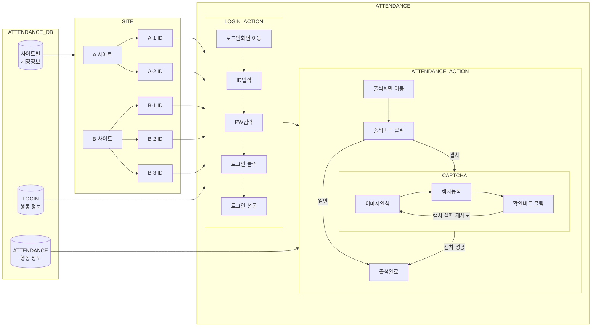

```mermaid
flowchart LR
	subgraph ATTENDANCE_DB
		DB1[(사이트별
		계정정보)]
		DB2[(LOGIN
		행동 정보)]
		DB3[(ATTENDANCE
		행동 정보)]
	end
	
		
	subgraph SITE
		A_SITE[A 사이트]
		A_SITE-1[A-1 ID]
		A_SITE-2[A-2 ID]
		B_SITE[B 사이트]
		B_SITE-1[B-1 ID]
		B_SITE-2[B-2 ID]
		B_SITE-3[B-3 ID]
	end
	
	subgraph ATTENDANCE
		direction LR
		
		subgraph LOGIN_ACTION
			direction TB
			LOGIN_ACTION_1[로그인화면 이동]
			LOGIN_ACTION_2[ID입력]
			LOGIN_ACTION_3[PW입력]
			LOGIN_ACTION_4[로그인 클릭]
			LOGIN_ACTION_5[로그인 성공]
			
			LOGIN_ACTION_1 --> LOGIN_ACTION_2 --> LOGIN_ACTION_3 --> LOGIN_ACTION_4 --> LOGIN_ACTION_5
		end
		
		subgraph ATTENDANCE_ACTION
			direction TB
			ATTENDANCE_ACTION_1[출석화면 이동]
			ATTENDANCE_ACTION_2[출석버튼 클릭]
			ATTENDANCE_ACTION_3[출석완료]
			subgraph CAPTCHA
				direction LR
				CAPTCHA_1[이미지인식]
				CAPTCHA_2[캡차등록]
				CAPTCHA_3[확인버튼 클릭]
				
				CAPTCHA_1 --> CAPTCHA_2 --> CAPTCHA_3 --> |캡차 실패 재시도|CAPTCHA_1
			end
			
			ATTENDANCE_ACTION_1 --> ATTENDANCE_ACTION_2
			ATTENDANCE_ACTION_2 --> |일반|ATTENDANCE_ACTION_3
			ATTENDANCE_ACTION_2 --> |캡차|CAPTCHA --> |캡차 성공|ATTENDANCE_ACTION_3
				
		end

	    A_SITE --> A_SITE-1 --> LOGIN_ACTION
	    A_SITE --> A_SITE-2 --> LOGIN_ACTION
	    B_SITE --> B_SITE-1 --> LOGIN_ACTION
	    B_SITE --> B_SITE-2 --> LOGIN_ACTION
	    B_SITE --> B_SITE-3 --> LOGIN_ACTION
		LOGIN_ACTION --> ATTENDANCE_ACTION
	end
	
	DB1 --> SITE
	DB2 --> LOGIN_ACTION
	DB3 --> ATTENDANCE_ACTION
```
