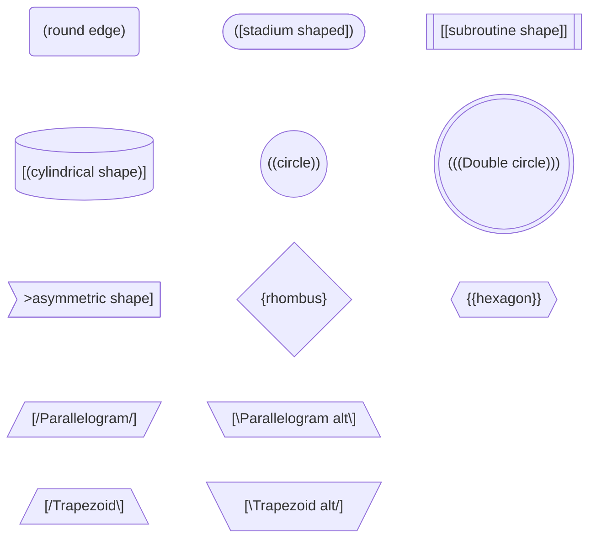
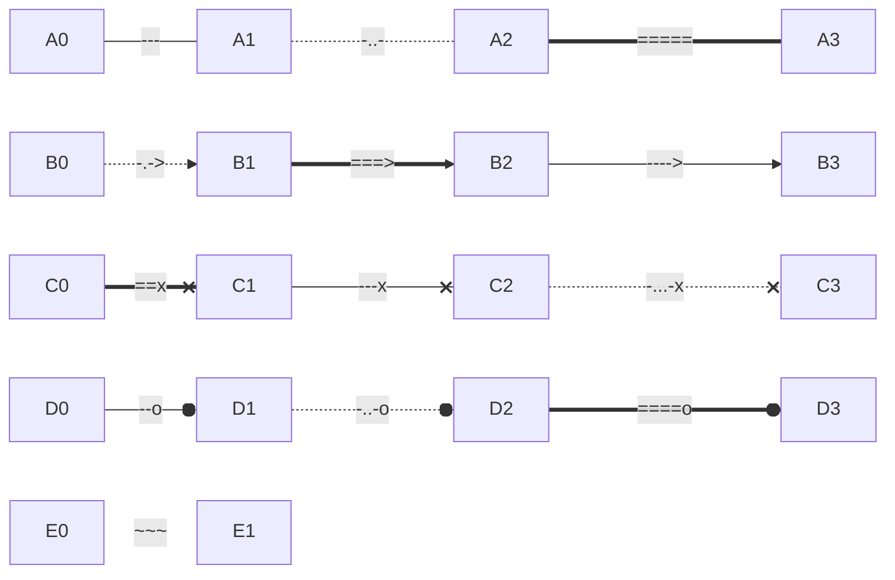
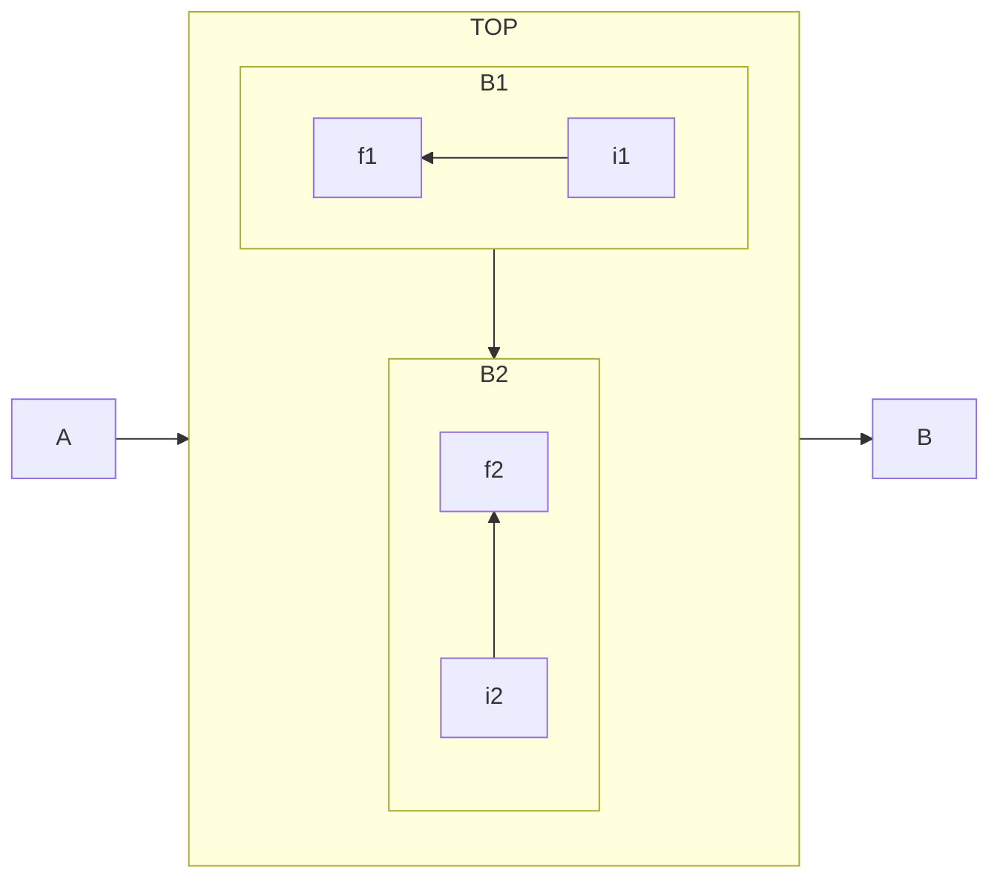

### 방향

```mermaid
flowchart RL
    Start --> Stop
```
- TB - Top to bottom
- TD - Top-down/ same as top to bottom
- BT - Bottom to top
- RL - Right to left
- LR - Left to right

## 노드 모양

```mermaid
flowchart LR
    a(#40;round edge#41;)
	b([#40;#91;stadium shaped#93;#41;])
    c[[#91;#91;subroutine shape#93;#93;]]
    d[(#91;#40;cylindrical shape#41;#93;)]
    e((#40;#40;circle#41;#41;))
    f(((#40;#40;#40;Double circle#41;#41;#41;)))
    g>#62;asymmetric shape#93;]
    h{#123;rhombus#125;}
    i{{#123;#123;hexagon#125;#125;}}
    j[/#91;#47;Parallelogram#47;#93;/] 
    k[\#91;#92;Parallelogram alt#92;#93;\]
    l[/#91;#47;Trapezoid#92;#93;\]
    m[\#91;#92;Trapezoid alt#47;#93;/]
    
	a ~~~ b ~~~ c
	d ~~~ e ~~~ f
	g ~~~ h ~~~ i
	j ~~~ k
	l ~~~m
```

## 링크 및 화살표 머리

```mermaid
flowchart LR
    A0---|---|A1-..-|-..-|A2=====|=====|A3
    B0-.->|-.->|B1===>|===>|B2---->|---->|B3
    C0==x|==x|C1---x|---x|C2-...-x|-...-x|C3
    D0--o|--o|D1-..-o|-..-o|D2====o|====o|D3
	
	E0~~~|~#126;~|E1
```

## 하위 그래프

```mermaid
flowchart LR
  subgraph TOP
    direction TB
    subgraph B1
        direction RL
        i1 -->f1
    end
    subgraph B2
        direction BT
        i2 -->f2
    end
  end
  A --> TOP --> B
  B1 --> B2
```
