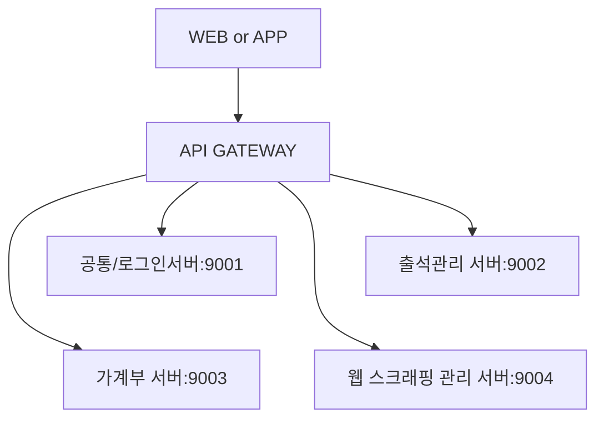
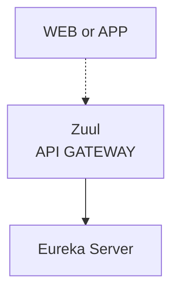

# 서비스 구성

```mermaid
flowchart TB
	UI[WEB or APP]
    A[API GATEWAY]
    B[공통/로그인서버:9001]
    C[출석관리 서버:9002]
    D[가계부 서버:9003]
    E[웹 스크래핑 관리 서버:9004]
    
	UI --> A --> B & C & D & E
	B & C ~~~ D & E
```

# 아키텍쳐 구성
# 서비스 구성

```mermaid
flowchart TB
	UI[WEB or APP]
    A[Zuul
		API GATEWAY]
    B[Eureka Server]
    UI -.-> A
    A --> B
```

![[Pasted image 20240620125939.png]]