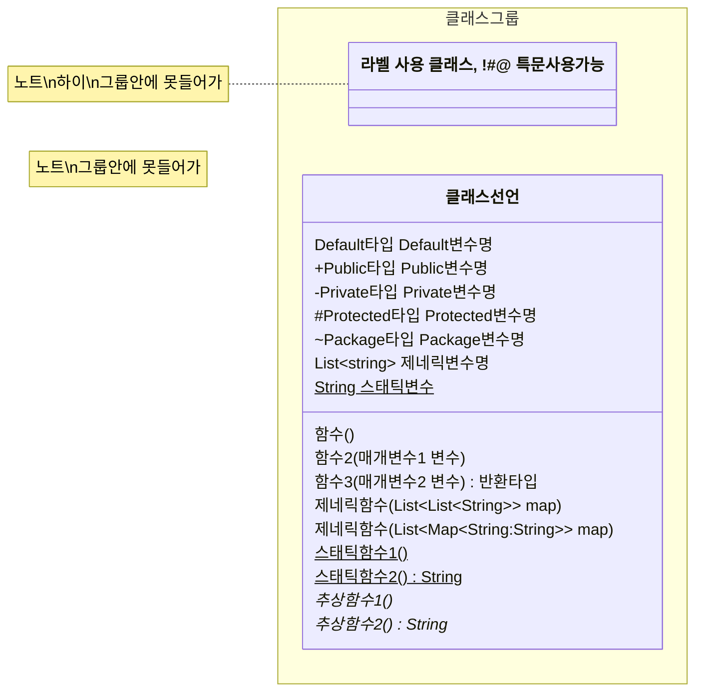
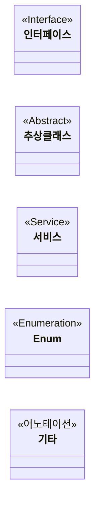
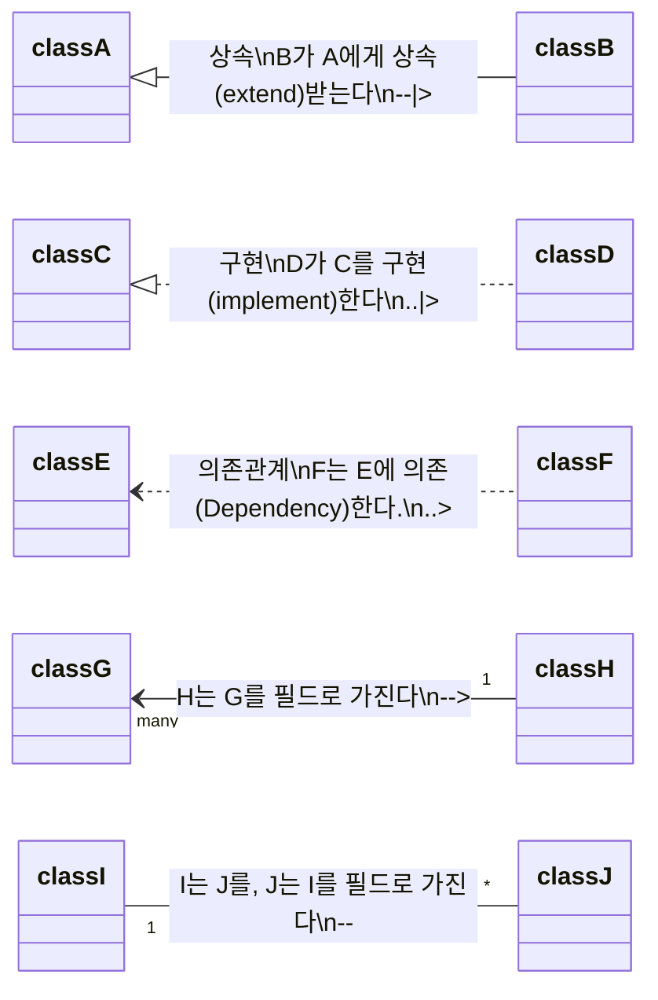
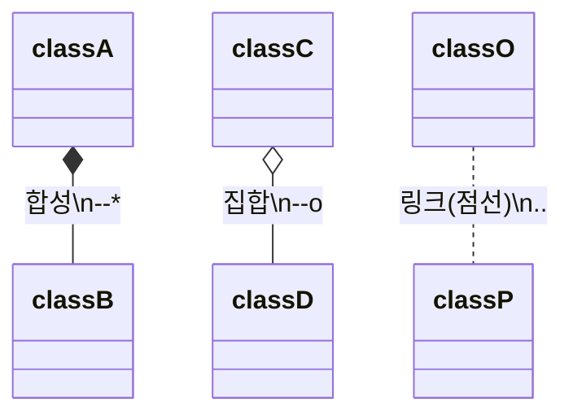

## 클래스정의

```mermaid
classDiagram  
direction LR
  
note for `라벨 사용 클래스, !#@ 특문사용가능` "노트\n하이\n그룹안에 못들어가"
note "노트\n그룹안에 못들어가"

namespace 클래스그룹 {
	
	class `라벨 사용 클래스, !#@ 특문사용가능`
	class 클래스선언{
	    Default타입 Default변수명
	    +Public타입 Public변수명
	    -Private타입 Private변수명
	    #Protected타입 Protected변수명
	    ~Package타입 Package변수명
	    List~string~ 제네릭변수명
		String 스태틱변수$
	    
	    함수()
	    함수2(매개변수1 변수)
	    함수3(매개변수2 변수) 반환타입
	    제네릭함수(List~List~String~~ map)
	    제네릭함수(List~Map~String:String~~ map)
	    스태틱함수1()$
	    스태틱함수2() String$
	    추상함수1()*
	    추상함수2() String*
	}
	
}
```

### 어노테이션 사용으로 다양한 클래스 정의

```mermaid
classDiagram  
direction LR
class 인터페이스{
	<<Interface>>
}
class 추상클래스{
	<<Abstract>>
}
class 서비스{
	<<Service>>
}
class Enum{
	<<Enumeration>>
}
class 기타{
	<<어노테이션>>
}
```

## 관계정의

```mermaid
classDiagram  
direction LR
classA <|-- classB : 상속\nB가 A에게 상속(extend)받는다\n--|>
classC <|.. classD : 구현\nD가 C를 구현(implement)한다\n..|>
classE <.. classF : 의존관계\nF는 E에 의존(Dependency)한다.\n..>
classG "many" <-- "1" classH : H는 G를 필드로 가진다\n-->
classI "1" -- "*" classJ : I는 J를, J는 I를 필드로 가진다\n--
```

### 뭔지모름

```mermaid
classDiagram
classA *-- classB : 합성\n--*
classC o-- classD : 집합\n--o
classO .. classP : 링크(점선)\n..
```
