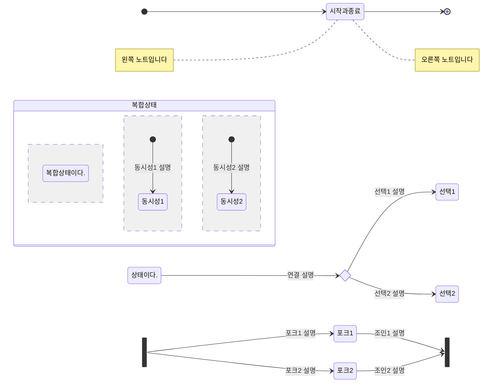

```mermaid
stateDiagram-v2  
	direction LR
    
    상태: 상태이다.  
    
    [*] --> 시작과종료
    시작과종료 --> [*]
	note right of 시작과종료
		오른쪽 노트입니다
	end note
	note left of 시작과종료
		왼쪽 노트입니다
	end note
    
    state 선택 <<choice>>
    상태 --> 선택: 연결 설명
    선택 --> 선택1: 선택1 설명
    선택 --> 선택2: 선택2 설명
    
	state 포크 <<fork>>
    포크 --> 포크1: 포크1 설명
    포크 --> 포크2: 포크2 설명
    
	state 조인 <<join>>
	포크1 --> 조인: 조인1 설명
	포크2 --> 조인: 조인2 설명
	
    state 복합상태 { 
		direction TB
		복합상태설명: 복합상태이다.
		--
		direction TB
        [*] --> 동시성1: 동시성1 설명
        --
		direction TB
        [*] --> 동시성2: 동시성2 설명
    }
```
