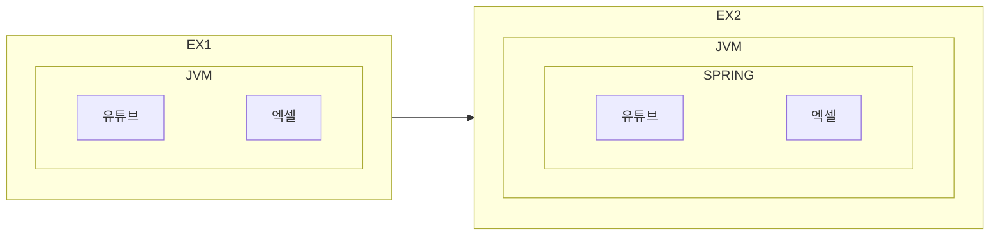
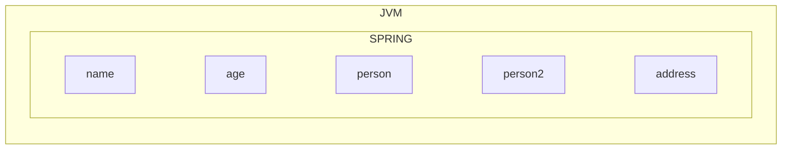

## 스프링 어플리케이션 생성

1. [Spring Initializr](https://start.spring.io/) 를 통한 스프링부트 프로젝트 생성
	- 빌드 도구 선택
	- 언어 선택(Java)
	- 버전선택
	- 그룹, 아티팩트 아이디 작성
	- 자바 버전 설정(17 추천)
	- 생성
2. 프로젝트 세팅
	- File > Import >  ...

## 어플리케이션 시작하기

기본적인 의존성 주입을 해보자

```java
//1. AppProgramBasic.java 생성
public class AppProgramBasic {
	public static void main(String[] args){
		var youtube = new Youtube();
		var programRunner = new ProgramRunner(youtube);
		programRunner.run();
	}
}

//2. ProgramRunner.java 생성
public class ProgramRunner {
	private Youtube program;
	public ProgramRunner (Youtube program){
		this.program = program;
	}
	
	public void run(){
		System.out.println("프로그램 시작 : " + program);
		program.up();
		program.down();
		program.left();
		program.right();
	}
}

//3. Youtube.java 생성
public class Youtube {
	public void up(){
		System.out.println("볼륨올리기");
	};
	public void down(){
		System.out.println("볼륨내리기");
	};
	public void left(){
		System.out.println("이전으로 10초 이동");
	};
	public void right(){
		System.out.println("이후로 10초 이동");
	};
} 
```

## 강한결합

실행할 프로그램이 변경된다면?

```java
//1. AppProgramBasic.java 수정
public class AppProgramBasic {
	public static void main(String[] args){
		//var youtube = new Youtube();
		//var programRunner = new ProgramRunner(youtube);
		
		//1-1.프로그램 추가
		var excel = new Excel();
		//2-1. 추가된 프로그램을 실행하기 위해 수정해야함
		var programRunner = new ProgramRunner(excel);
		programRunner.run();
	}
}

//2. Excel.java 생성
public class Excel {
	public void up(){
		System.out.println("셀 위 이동");
	};
	public void down(){
		System.out.println("셀 아래 이동");
	};
	public void left(){
		System.out.println("셀 왼쪽 이동");
	};
	public void right(){
		System.out.println("셀 오른쪽 이동");
	};
} 

//3. ProgramRunner.java 수정
public class ProgramRunner {
	private Excel program; //실행할 프로그램에 맞춰야함
	public ProgramRunner (Excel program){
		this.program = program;
	}
	
	public void run(){
		System.out.println("프로그램 시작 : " + program);
		program.up();
		program.down();
		program.left();
		program.right();
	}
}
```

무언가를 변경하는데 많은 작업이 관련 되어있다면 강한결합

## 느슨한 결합

인터페이스를 사용

```java
//1. Program 인터페이스 작성
interface Program {
	void up();
	void down();
	void left();
	void right();
}

//2. Excel.java implements Program
public class Excel implements Program {
	public void up(){
		System.out.println("셀 위 이동");
	};
	public void down(){
		System.out.println("셀 아래 이동");
	};
	public void left(){
		System.out.println("셀 왼쪽 이동");
	};
	public void right(){
		System.out.println("셀 오른쪽 이동");
	};

//3. ProgramRunner.java 수정
public class ProgramRunner {
	private Program program; //인터페이스 사용
	public ProgramRunner (Program program){
		this.program = program;
	}
	
	public void run(){
		System.out.println("프로그램 시작 : " + program);
		program.up();
		program.down();
		program.left();
		program.right();
	}
}

//4. AppProgramBasic.java 수정
public class AppProgramBasic {
	public static void main(String[] args){
		//var youtube = new Youtube();
		//var programRunner = new ProgramRunner(youtube);
		
		//4-1. 인터페이스 사용
		var excel = new Excel();
		var programRunner = new ProgramRunner(excel);
		programRunner.run();
	}
}
```


```java
//동작 순서 확인
public class AppProgramBasic {
	public static void main(String[] args){
		var excel = new Excel(); //1. 오브젝트 생성
		
		//2. 오브젝트 생성 + 의존성 주입
		var programRunner = new ProgramRunner(excel);
		//프로그램 러너는 프로그램을 실행 시킬 수 있어야하며, 프로그램이 필요함
		//프로그램은 프로그램 러너 클래스의 의존성이다.
		//A 실행시 B가 필요하다 > A는 B에 의존한다.
		
		programRunner.run();
	}
}
```

이런 의존 관계의 관리를 해주는게 스프링 프레임워크



완성 될 예제

