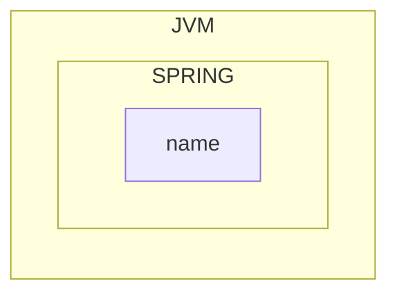

## 첫 번째 빈 만들기




```java
public class App02HelloWorldSpring {
	public static void main(String[] args){
		var context = new AnnotationConfigApplicationContext(HelloWorldConfiguration.class)

		System.out.println(context.getBean("name"));
		System.out.println(context.getBean("age"));
	}
}

@Configuration
public class HelloWorldConfiguration {
	@Bean
	public String name(){
		return "이름";
	}
	
	@Bean
	public int age(){
		return 15;
	}
}
```