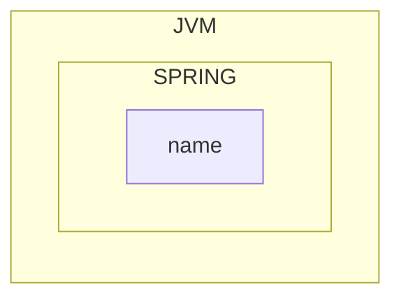

## 첫 번째 빈 만들기




```java
public class App02HelloWorldSpring {
	public static void main(String[] args){
		//1: Launch a Spring Context
		var context = 
			new AnnotationConfigApplicationContext(HelloWorldConfiguration.class);
		
		//2: Configure the things that we want Spring to manage - 
		//HelloWorldConfiguration - @Configuration
		//name - @Bean
		
		//3: Retrieving Beans managed by Spring
		System.out.println(context.getBean("name"));
	}
}

@Configuration // 하나 이상의 Bean을 선언함을 나타내는 어노테이션
public class HelloWorldConfiguration {
	@Bean
	public String name(){
		return "이름";
	}
}
```