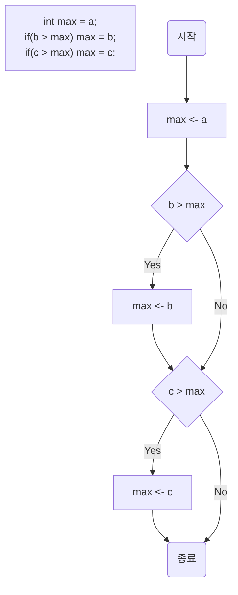
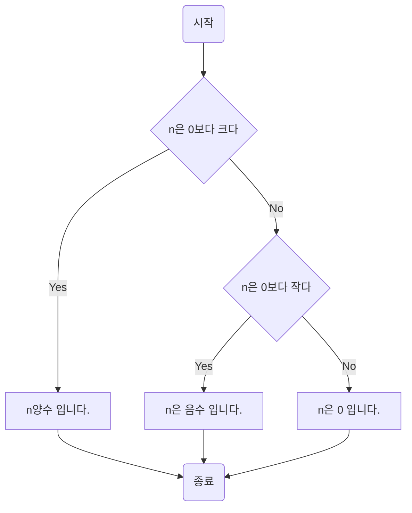
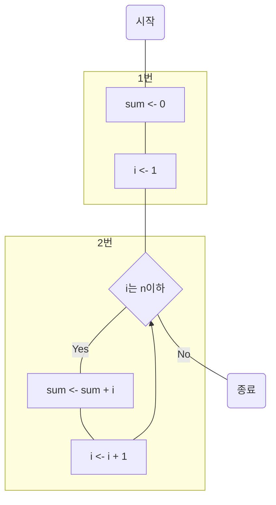
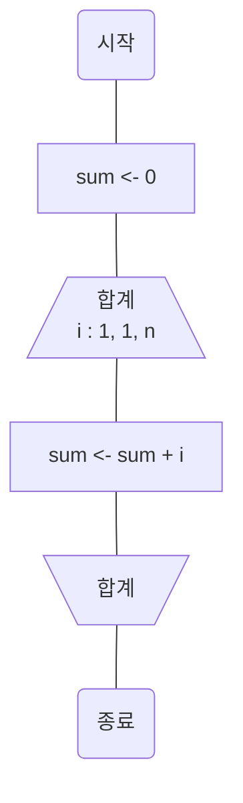
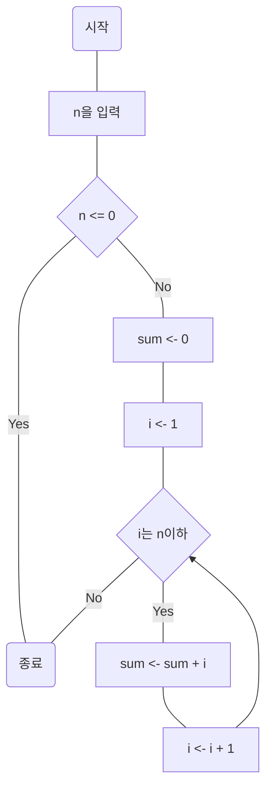

## 알고리즘이란?

> 어떤 문제를 해결하기 위한 절타로, 명확하게 정의되고 순서가 있는 유한 개의 규칙으로 이루어진 집합

### 세 값의 최댓값 구하기

간단한 프로그램을 통해 알아보겠습니다. 다음은 3개의 숫자 중 가장 큰 값을 구하는 예 입니다 :

```java
public static void main(String[] args){
	Scanner stdIn = new Scanner(System.in).nextInt();
	
	int a = stdIn.nextInt();
	int b = stdIn.nextInt();
	int c = stdIn.nextInt();
	
	int max = a;
	if(b > max) max = b;
	if(c > max) max = c;
	
	System.out.println(max);
}
```

최댓값을 구하는 과정은 다음과 같습니다.

> 1. max에 a값을 넣습니다.
> 2. b값이 max보다 크면 max에 b값을 넣습니다.
> 3. c값이 max보다 크면 max에 c값을 넣습니다.

세 문장이 아래로 나란히 있다면 이 문장은 순서대로 실행되며, 이렇게 순차적으로 실행되는 구조를 순차(sequential)구조라고 합니다. 다만 1번은 대입이지만 2번과 3번은 if문이며 이처럼 결과에 따라 프로그램의 실행 흐름을 변경하는 구조를 선택(selection)구조라고 합니다.

다음은 최댓값을 구하는 순서도 입니다 :



3가지 변수에 어떠한 값을 넣어도 다음 프로세스에 따라 최대 값을 올바르게 가져올 수 있습니다.

### 조건 판단과 분기

다음은 입력한 정숫값의 부호를 판단하는 프로그램입니다 :

```java
public static void main(String[] args) {
	Scanner stdIn = new Scanner(System.in);
	
	System.out.print("정수를 입력하세요.: ");
	
	int n = stdIn.nextInt();
	
	if (n > 0) {
		System.out.println("이 수는 양수입니다.");
	} else if {
		(n < 0) System.out.println("이 수는 음수입니다.");
	} else {
		System.out.println("이 수는 0입니다.");
	}
}
```

부호를 판단하는 과정은 다음과 같습니다.

> 1. 값이 0보다 크다면 n은 양수이다.
> 2. 값이 0보다 작다면 n은 음수이다.
> 3. 그게 아니라면 n은 0이다.

다음은 최댓값을 구하는 순서도 입니다 :



## 반복

어떤 조건이 성립하는 동안 처리를 반복하여 실행하는 것을 반복(repetition)구조라 하며 루프(loop)라고 부릅니다. 이 섹션에서는 프로그램의 흐름을 반복하는 간단한 알고리즘을 살펴봅니다.

### 1부터 n까지의 정수의 합 구하기

n으로 2를 입력하면 1과 2의 합을 구하고, 3을 입력하면 1과 2와 3의 합을 구하는 알고리즘을 구현합니다.
#### while 문 반복

실행전에 반복을 계속할지 판단하는데, 이를 '사전판단반복'이라고 합니다. 제어식의 평가값이 true이면 프로그램의 명령문을 반복합니다.

다음은 while 문으로 구현한 프로그램입니다:

```java
public static void main(String[] args) {
	Scanner stdIn = new Scanner(System.in);

	System.out.println("1부터 n까지의 합을 구합니다.");
	System.out.print("n값: ");
	int n = stdIn.nextInt();

	int sum = 0;            // 합
	int i = 1;

	while (i <= n) {        // i가 n 이하면 반복
		sum += i;           // sum에 i를 더함
		i++;                // i 값을 1 증가(increment)
	}
	System.out.println("1부터" + n + "까지의 합은 " + sum + "입니다.");
}
```

>while (제어식) 명령문

다음은 while 문의 순서도 입니다 :



1. 합을 구하기 위한 초기화 입니다. 합을 저장하는 변수 `sum`을 0, 반복을 제어하기 위한 변수 `i`를 1로 초기화 합니다.
2. 변수 `i` 값이 `n` 이하인 동안 `i`값을 1씩 증가하면서 루프 본문을 `n`회 반복하여 실행합니다.

#### for 문 반복

하나의 변수를 사용하는 반복문은 while 문보다 for 문을 사용하는 것이 좋습니다.

다음은 for 문으로 구현한 프로그램입니다:

```java
    public static void main(String[] args) {
        Scanner stdIn = new Scanner(System.in);

        System.out.println("1부터 n까지의 합을 구합니다.");
        System.out.print("n 값 : ");
        int n = stdIn.nextInt();

        int sum = 0;                // 합

        for (int i = 1; i <= n; i++)
            sum += i;               // sum에 i를 더함
            
        System.out.println("1부터" + n + "까지의 합은 " + sum + "입니다.");

    }
```


>for(초기화 부분; 제어식; 업데이트 부분) 명령문

초기화 부분은 for 문을 실행하기 전에 한번만 실행되며, 제어식을 평가한 값이 true이면 for 문의 명령문을 반복합니다. 명령문을 실행한 다음에는 업데이트 부분을 실행합니다.

다음은 for 문의 순서도 입니다 :



### 양수만 입력받아 1부터 n까지의 합구하기

#### do while 문 반복

실행후에 반복을 계속할지 판단하는데, 이를 '사후판단반복'이라고 합니다. 제어식의 평가값이 true이면 프로그램의 명령문을 반복하며 반드시 한번은 무조건 실행되며 그 뒤에 제어식을 실행합니다.

다음은 do while을 사용하여 구현된 양수만 받는 프로그램입니다 :

```java
public static void main(String[] args) {
	Scanner stdIn = new Scanner(System.in);
	int n;
	
	System.out.println("1부터 n까지의 합을 구합니다.");
	
	do {
		System.out.print("n값: ");
		n = stdIn.nextInt();
	} while (n <= 0);
	
	int sum = 0;        // 합
	
	for (int i = 1; i <= n; i++)
		sum += i;       // sum에 i를 더함
	
	System.out.println("1부터 " + n + "까지의 합은 " + sum + "입니다.");
}
```

>do while 문 (제어식);

다음은 do while 문의 순서도 입니다 :


