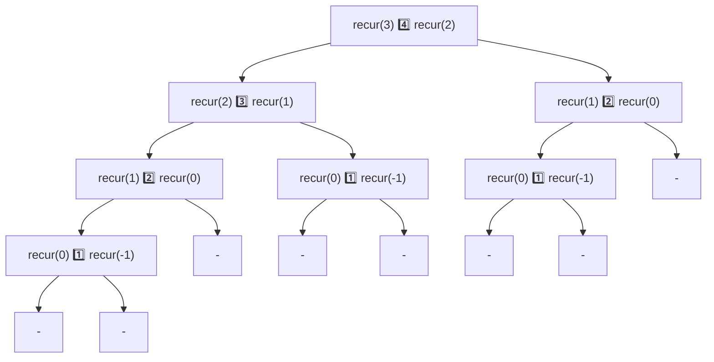

## 재귀란?

어떤 사건이 자기 자신을 포함하거나 또는 자기 자신을  사용하여 정의하고 있을 때 이를 재귀적이라고 합니다.

## 팩토리얼 구하기

재귀를 사용한 예로 정수의 팩토리얼 값을 구하는 프로그램을 살펴봅니다.

- 0! = 1
- n > 0 이면 n! = n * (n-1)!

10의 팩토리얼인 10!은 10 * 9! 으로 구할 수 있고, 그 우변에서 사용한 식 9!은 9 * 8! 로 구할 수 있습니다.

다음은 위의 정의를 구현한 프로그램 입니다:

```java
//--- 음이 아닌 정수 n의 팩토리얼 값을 반환 ---//
static int factorial(int n) {
	return (n > 0) ? n * factorial(n - 1) : 1;
}
```

factorial 메서드가 반환하는 값은 다음과 같습니다.

- 매개변수 n에 전달받은 값이 0보다 클 때 : n * factorial(n-1)
- 매개변수 n에 전달받은 값이 0보다 크지 않을 때 : 1

재귀 알고리즘에 알맞는 경우는 '풀어야 할 문제', '계산할 메서드', '처리할 자료구조'가 재귀로 정의되는 경우로, 앞의 팩토리얼 값을 구하는 예는 재귀의 원리를 이해하기에는 좋지만 효율적이진 않습니다.

### 재귀 호출

factorial 메서드는 n-1의 팩토리얼 값을 구하기 위해 다시 factorial 메서드를 호출합니다. 이를 재귀 호출이라고 합니다.

>[!note] 
>재귀 호출을 '메서드 자신'을 호출하는게 아닌 '자기 자신과 똑같은 메서드' 를 호출한다고 이해하는 것이 자연스럽습니다.

### 직접 재귀와 간접 재귀

factorial 메서드는 내부에서 factorial 메서드를 호출합니다. 이처럼 자신과 동일한 메서드를 호출 하는 것을 직접 재귀라 합니다. 간접 재귀는 메서드 a가 메서드 b를 호출하고 , 다시 메서드 b가 메서드 a를 호출하는 구조로 이루어집니다.

## 유클리드 호제법

두 정수의 최대공약수를 재귀적으로 구하는 방법을 알아봅니다. 두 정수를 직사각형 두 변의 길이라고 생각하면 두 정수의 최대공약수를 구하는 문제는 다음과 같습니다.

직사각형을 정사각형으로 빈틈없이 채웁니다. 이렇게 만들어지는 정사각형 가운데 가장 긴 변의 길이를 구하세요.

> [!note] 최대공약수
>  두 정수의 약수중 가장 큰 공통이 되는 약수

위의 문제를 구체적으로 설명하면 다음과 같습니다.

1. 22 x 8 크기의 직사각형에서 짧은 변(8)을 한 변으로 하는 정사각형으로 직사각형을 분할 합니다.
2. 남은 8 x 6 크기의 직사각형을 다시 같은 과정으로 분할합니다.
3. 남은 6 x 2 크기의 직사각형에 같은 과정을 수행합니다. 2 x 2 크기의 정사각형 3개로 나눌 수 있으며, 여기서 얻은 2가 최대공약수 입니다.

이렇게 두 정수가 주어질 경우 큰값을 작은 값으로 나누었을 때 나누어 떨어지면 그중에 작은 값이 최대공약수입니다(**과정 3**). 나누어 떨어지지 않으면 작은 값과 나머지 나누어 떨어질 때 까지 같은 과정을 재귀적으로 반복합니다(**과정 1,2**).

다음은 이 과정을 수학적으로 표현합니다:

1. x와 y의 최대공약수를 G라고 정의합니다:  
$$
\begin{aligned}
GCD(x, y) = G
\end{aligned}
$$

2. x와 y가 서로소이면 G는 최대공약수입니다:  
$$
\begin{aligned}
&x=XG \\
&y=YG
\end{aligned}
$$

3. q가 x를 y로 나눈 값의 몫이고 r은 나머지 값이라면 x는 다음과 같이 정의 할 수 있습니다:  
$$
\begin{aligned}
x = qy + r
\end{aligned}
$$

4. r은 다음과 같이 정의되며, G는 y와 R의 공약수임을 알 수 있습니다:  
$$
\begin{aligned}
r
& = x - qy \\
& = XG - qYG \\
& = (X - qY)G
\end{aligned}
$$

5. y와 r은 이렇게 정의 되었고, y와 r은 서로소 관계이며, 여전히 두 사이의 최대공약수는 G인것을 확인 할 수 있습니다:  
$$
\begin{aligned}
&y = YG \\
&r = (X - qY)G
\end{aligned}
$$  

6. 결국 GCD(x, y)는 GCD(y, x % y)과 같습니다:  
$$
\begin{aligned}
GCD(x, y) = GCD(y, r)
\end{aligned}
$$

다음은 위에 정의된 유클리드 호제법을 구현한 프로그램 입니다:

```java
//--- 정수 x, y의 최대공약수를 구하여 반환 ---//
static int gcd(int x, int y) {
	return y == 0 ? x : gcd(y, x % y);
}
```

> [!question]- 배열 모든 요소의 최대공약수 구하기
> 
> ```java
> //--- 정숫값 x, y의 최대 공약수를 비재귀적으로 구하여 반환 ---//
>static int gcd(int x, int y) {
>	while (y != 0) {
>		int temp = y;
>		y = x % y;
>		x = temp;
>	}
>	return (x);
>}
>
>//--- 요솟수가 n인 배열 a의 모든 요소의 최대 공약수를 구합니다 ---//
>static int gcdArray(int a[], int start, int no) {
>	if (no == 1)
>		return a[start];
>	else if (no == 2)
>		return gcd(a[start], a[start + 1]);
>	else
>		return gcd(a[start], gcdArray(a, start + 1, no - 1));
>}
> ```


## 재귀 알고리즘 분석하기

다음 프로그램은 재귀 메서드인 recur 메서드와 main 메서드로 구성되어 있습니다:

```java
static void recur(int n) {
	if (n > 0) {
		recur(n - 1);
		System.out.println(n);
		recur(n - 2);
	}
}
```

recur 메서드는 재귀 호출을 2회 실행하는데, 이처럼 재귀 호출을 여러번 실행하는 메서드는 순수 재귀라 합니다. 아래는 4를 입력하면 출력되는 수의 결과입니다.

> 1 2 3 1 4 1 2

다음은 이 메서드의 동작을 분석합니다. 하향식 분석과 상향식 분석이 있습니다.

### 하향식 분석

매개변수로 4를 전달하면 다음과정을 순서대로 실행합니다.
1. recur(3)을 실행합니다.
2. 4를 출력합니다.
3. recur(2)을 실행합니다.

`2`번이 실행되려면 `1`번이 완료되어야 합니다. 이해하기 쉽게 그림으로 그립니다.



'왼쪽 화살표를 따라 한 칸 아래 상자로 이동하고 다시 원래 상자로 돌아오면 사각형 숫자를 출력한 뒤 오른쪽 상자를 따라 한 칸 아래 상자로 이동한다'를 하나의 작업으로 생각하면 됩니다.

이처럼 가장 위쪽에 위치한 상자의 메서드를 호출하는 것부터 시작하여 계단식으로 자세히 조사해 나가는 분석 기법을 하향식 분석이라고 합니다. 다만 recur(2) 와 recur(1)을 여러번 호출하기에 '하향식 분석이 반드시 효율적이다'라고 할 수 는 없습니다.

### 상향식 분석

아래쪽부터 쌓아 올리며 분석하는 방법입니다. recur 메서드는 n이 양수일 때만 실행되므로 먼저 recur(1)을 확인합니다.
1. recur(0)을 실행합니다.
2. 1를 출력합니다.
3. recur(-1)을 실행합니다.

recur(1)은 1만 출력합니다. 다음으로 recur(2)를 확인합니다.
1. recur(1)을 실행합니다.
2. 2를 출력합니다.
3. recur(0)을 실행합니다.

recur(1)은 1을 출력하고 recur(0)은 출력하지 않습니다. 그러므로 1과 2가 출력됩니다. 이 작업을 recur(4) 까지 쌓아올리면 다음과 같습니다.

recur(1): recur(0) 1️⃣ recur(-1) > 1️⃣
recur(2): recur(1) 2️⃣ recur(0) > 1️⃣2️⃣
recur(3): recur(2) 3️⃣ recur(1) > 1️⃣2️⃣3️⃣1️⃣
recur(4): recur(3) 4️⃣ recur(2) > 1️⃣2️⃣3️⃣1️⃣4️⃣1️⃣2️⃣

## 재귀 알고리즘의 비재귀적 표현

recur 메서드를 재귀 호출을 사용하지 않고 비재귀적으로 구현하는 방법을 살펴봅니다.

### 꼬리 재귀의 제거

메서드의 꼬리에서 재귀호출하는 메서드 recur(n-2)는 다음처럼 바꿀 수 있습니다.

>n을 n-2로 업데이트하고 메서드의 시작 지점으로 돌아갑니다.

```java
static void recur(int n) {
	while (n > 0) {
		recur(n - 1);
		System.out.println(n);
		n = n - 2;
	}
}
```

### 재귀의 제거

재귀호출 recur(n - 1)을 바로제거 할 수 없습니다. 다음과 같은 단계가 필요합니다.

1. 현재 n 값을 잠시 저장합니다.
2. recur(n) 을 실행합니다.
3. 저장했던 n값을 꺼내 출력합니다.

다음은 스택을 사용하여 비재귀적으로 구현한 프로그램입니다:

```java
//--- 재귀를 제거한 recur ---//
static void recur(int n) {
	IntStack s = new IntStack(n);

	while (true) {
		if (n > 0) {
			s.push(n);         // n 값을 푸시
			n = n - 1;
			continue;
		}
		if (!s.isEmpty()) {    // 스택이 비어 있지 않으면
			n = s.pop();       // 저장하고 있던 값을 n에 팝
			System.out.println(n);
			n = n - 2;
			continue;
		}
		break;
	}
}
```

## 메모화

recur 메서드는 실행과정에서 같은 계산을 여러번 반복합니다. 어떤 문제에 대한 답을 구한 경우 그것을 메모해둡니다. 중복된 함수가 호출되었을 때 메모해 둔 문자열을 출력하면서 중복계산을 제거합니다.

recur(3)은 1,2,3,1을 출력하므로 메모합니다. 다시 recur(3)이 호출될 때 메모해 둔 문자를 출력합니다.

다음은 메모화를 사용하여 구현한 프로그램입니다: 

```java
//--- 메모화를 도입한 메서드 recur ---//
static void recur(int n) {
	if (memo[n + 1] != null)
		System.out.print(memo[n + 1]);                              // 메모를 출력
	else {
		if (n > 0) {
			recur(n - 1);
			System.out.println(n);
			recur(n - 2);
			memo[n + 1] = memo[n] + n + "\n" + memo[n - 1];        // 메모화
		} else {
			memo[n + 1] = "";     // 메모화 : recur(0)과 recur(-1)은 빈 문자열
		}
	}
}
```

### recur 메서드에서 메모 활용

recur 메서드의 동작이 업데이트될 경우 다음처럼 처리합니다.

- 메모가 이미 되어 있는 경우 :
	메모의 내용 memo\[n+1\]을 화면에 그대로 출력하면 처리가 완료됩니다.
	
- 메모가 되어 있지 않은 경우 :
	n이 0보다 크면 먼저 기존 프로그램의 recur 메서드와 동일하게 처리한 뒤 메모용 배열의 요소 memo\[n+1\]에 출력한 동일한 내용의 문자열을 대입합니다.  
	n이 0보다 크지 않다면 n은 0 또는 1이므로 빈 문자열을 메모합니다.