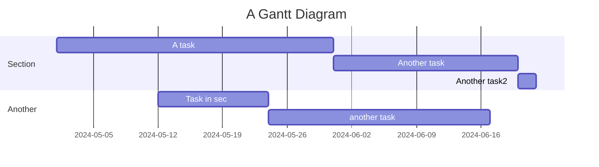
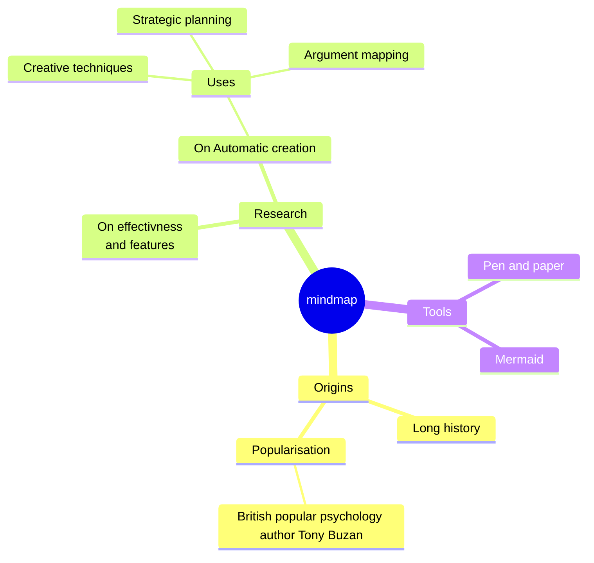

```mermaid
gantt
    title A Gantt Diagram
    dateFormat  YYYY-MM-DD
    
    section Section
    A task           :a1, 2024-05-01, 30d
    Another task     :a2, after a1 , 20d
    Another task2    :a3, after a2 , 2d
    
    section Another
    Task in sec      :2024-05-12  , 12d
    another task      : 24d
```

```mermaid
mindmap
  root((mindmap))
    Origins
      Long history
      ::icon(fa fa-book)
      Popularisation
        British popular psychology author Tony Buzan
    Research
      On effectivness<br/>and features
      On Automatic creation
        Uses
            Creative techniques
            Strategic planning
            Argument mapping
    Tools
      Pen and paper
      Mermaid
```