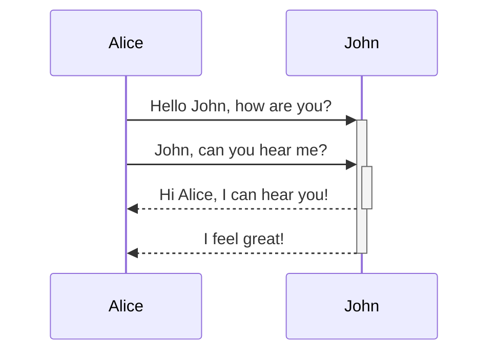
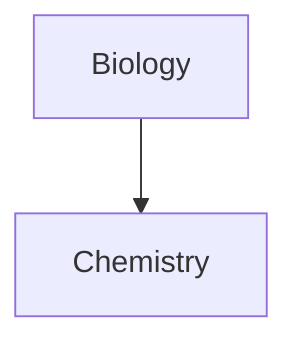

## 테이블

세로 막대()와 하이픈()을 사용하여 표를 만들 수 있습니다. 세로 막대는 열을 구분하고 하이픈은 열 머리글을 정의합니다.`|``-`

```md
| First name | Last name |
| ---------- | --------- |
| Max        | Planck    |
| Marie      | Curie     |
```

|이름|성|
|---|---|
|최대|플랑크|
|마리|퀴리|

테이블 양쪽에 있는 세로 막대는 선택 사항입니다.

셀을 열과 완벽하게 정렬할 필요는 없습니다. 각 머리글 행에는 하이픈이 두 개 이상 있어야 합니다.

```md
First name | Last name
-- | --
Max | Planck
Marie | Curie
```

### 표 내의 콘텐츠 서식 지정

[[기본 문법]]을 사용하여 표 내의 콘텐츠에 스타일을 지정할 수 있습니다.

|첫 번째 열|두 번째 열|
|---|---|
|[내부 링크](https://help.obsidian.md/Linking+notes+and+files/Internal+links)|**Vault** _내의_ 파일에 링크합니다.|
|[파일 포함](https://help.obsidian.md/Linking+notes+and+files/Embed+files)||

표의 세로 막대

[별칭을](https://help.obsidian.md/Linking+notes+and+files/Aliases) 사용하거나 표에서 [이미지 크기를 조정](https://help.obsidian.md/Editing+and+formatting/Basic+formatting+syntax#External%20images)하려면 세로 막대 앞에 `\`를 추가해야 합니다.

```md
First column | Second column
-- | --
[[Basic formatting syntax\|Markdown syntax]] | ![[og-image.png\|200]]
```

| 첫 번째 열                                                                                 | 두 번째 열 |
| -------------------------------------------------------------------------------------- | ------ |
| [Markdown 구문](https://help.obsidian.md/Editing+and+formatting/Basic+formatting+syntax) |        |

머리글 행에 콜론(`:`)을 추가하여 텍스트를 열의 왼쪽, 오른쪽 또는 가운데에 정렬할 수 있습니다.

```md
Left-aligned text | Center-aligned text | Right-aligned text
:-- | :--: | --:
Content | Content | Content
```

|왼쪽 정렬된 텍스트|가운데 정렬된 텍스트|오른쪽 정렬된 텍스트|
|:--|:-:|--:|
|콘텐츠|콘텐츠|콘텐츠|

## 다이어그램

[Mermaid](https://mermaid-js.github.io/)를 사용하여 메모에 다이어그램과 차트를 추가할 수 있습니다. Mermaid는 [순서도](https://mermaid.js.org/syntax/flowchart.html), [시퀀스 다이어그램](https://mermaid.js.org/syntax/sequenceDiagram.html) 및 [타임라인](https://mermaid.js.org/syntax/timeline.html)과 같은 다양한 다이어그램을 지원합니다.

Mermaid's [Live Editor](https://mermaid-js.github.io/mermaid-live-editor)를 사용하여 노트에 포함하기 전에 다이어그램을 작성할 수도 있습니다.

다이어그램을 추가하려면 `mermaid` [[기본 문법#코드 블록|코드 블록]]을 만듭니다.

````md

````


````md

````


### 다이어그램에서 파일 연결

[클래스를](https://mermaid.js.org/syntax/flowchart.html#classes) 노드에 연결하여 다이어그램에 [내부 링크를](https://help.obsidian.md/Linking+notes+and+files/Internal+links) 만들 수 있습니다.`internal-link`

````md

````


다이어그램의 내부 링크는 [그래프 뷰](https://help.obsidian.md/Plugins/Graph+view)에 표시되지 않습니다.

다이어그램에 많은 노드가 있는 경우 다음 코드 조각을 사용할 수 있습니다.

````md

````

이렇게 하면 각 문자 노드가 내부 링크가 되고 [노드 텍스트](https://mermaid.js.org/syntax/flowchart.html#a-node-with-text)가 링크 텍스트가 됩니다.

이름에 특수 문자를 사용하는 경우 메모 이름을 큰따옴표로 묶어야 합니다.

```
class "⨳ special character" internal-link
```

또는.`A["⨳ special character"]`

다이어그램 만들기에 대한 자세한 내용은 [공식 Mermaid 문서를](https://mermaid.js.org/intro/) 참조하세요.

## 수학

[MathJax](http://docs.mathjax.org/en/latest/basic/mathjax.html) 및 LaTeX 표기법을 사용하여 노트에 수학 표현식을 추가할 수 있습니다.

노트에 MathJax 표현식을 추가하려면 이중 달러 기호()로 묶습니다.`$$`

```md
$$
\begin{vmatrix}a & b\\
c & d
\end{vmatrix}=ad-bc
$$
```
$$
\begin{vmatrix}a & b\\
c & d
\end{vmatrix}=ad-bc
$$

수학 표현식을 기호로 래핑하여 인라인 할 수도 있습니다.`$`

```md
This is an inline math expression $e^{2i\pi} = 1$.
```

인라인 수학 식 e^{2i\pi} = 1입니다.

구문에 대한 자세한 내용은 [MathJax 기본 튜토리얼 및 빠른 참조](https://math.meta.stackexchange.com/questions/5020/mathjax-basic-tutorial-and-quick-reference)를 참조하십시오.

지원되는 MathJax 패키지 목록은 [TeX/LaTeX 확장 목록을](http://docs.mathjax.org/en/latest/input/tex/extensions/index.html) 참조하십시오.